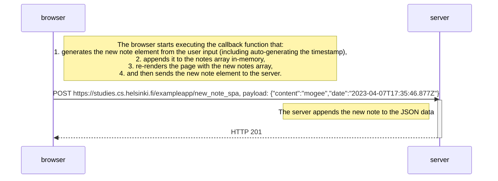

```mermaid
sequenceDiagram
    participant browser
    participant server

    Note right of browser: The browser starts executing the callback function that: <br/> 1. generates the new note element from the user input (including auto-generating the timestamp),<br/> 2. appends it to the notes array in-memory,<br/> 3.  re-renders the page with the new notes array,<br/> 4. and then sends the new note element to the server.
    browser->>server: POST https://studies.cs.helsinki.fi/exampleapp/new_note_spa, payload: {"content":"mogee","date":"2023-04-07T17:35:46.877Z"}
    activate server
    Note left of server: The server appends the new note to the JSON data
    server-->>browser: HTTP 201
    deactivate server

```