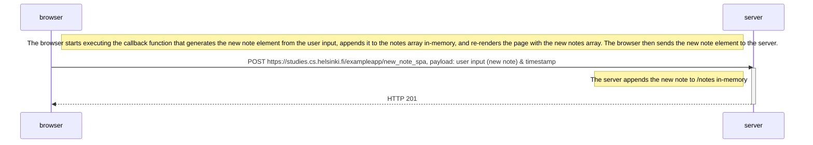

```mermaid
sequenceDiagram
    participant browser
    participant server

    Note right of browser: The browser starts executing the callback function that generates the new note element from the user input, appends it to the notes array in-memory, and re-renders the page with the new notes array. The browser then sends the new note element to the server.
    browser->>server: POST https://studies.cs.helsinki.fi/exampleapp/new_note_spa, payload: user input (new note) & timestamp
    activate server
    Note left of server: The server appends the new note to /notes in-memory
    server-->>browser: HTTP 201
    deactivate server

```